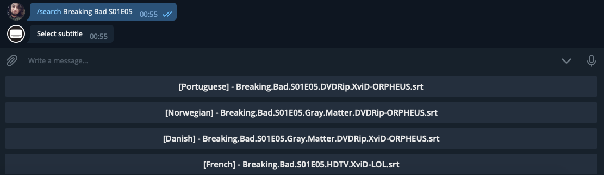

# Korero Bot
Telegram bot for searching subtitles.

<p align="center">
  
</p>

# Features
* /subtitles `name` - Search subtitles
* /theatres - In Theaters
* /popular movie - Popular movies
* /popular person - Popular persons
* /popular tv - Popular tv shows
* /trending all - Trending
* /trending movie - Trending movies
* /trending person - Trending persons
* /trending tv - Trending tv shows
* /help - Help
* /about - About

# Prerequisites
* [Node.js](https://nodejs.org/en/)

# Running
### 1. Configure
````
# Bot
Create and configure .env file like .env.example.
````

### 2. Telegram
````
# Create an Telegram bot
Find @BotFather on Telegram, type /newbot and follow the instructions.

# Username
Get your bot username and set 'TELEGRAM_USERNAME' in .env.

# Token
Get your token from @BotFather and set 'TELEGRAM_TOKEN' in .env.
````

### 3. OpenSubtitles
````
# Create an OpenSubtitles account
Create an OpenSubtitles account on https://opensubtitles.org.

# UserAgent
Request your own UserAgent https://trac.opensubtitles.org/projects/opensubtitles/wiki/DevReadFirst#Howtorequestanewuseragent. Only for testing and developing purposes you can use special user agent "TemporaryUserAgent". Never use this UA as default/public/in production code, we periodically change this and your APP will stop work! Also don't abuse usage of this test user agent.

# Configure
Get your UserAgent and credentials and set in .env.
````

### 4. TMDb
````
# Account
Create an The Movie DB account on https://www.themoviedb.org/.

# API Key
Create an API key on https://www.themoviedb.org/settings/api.

# Configure
Get your API key and set 'TMDB_APIKEY' in .env.
````

### 5. Run
````
# Install dependencies
npm install

# Start
npm start
````

# Built With
* [Node.js](https://nodejs.org/en/)

# Authors
* [xxgicoxx](https://github.com/xxgicoxx)

# Acknowledgments
* [FlatIcon](https://www.flaticon.com/)
* [OpenSubtitles](https://www.opensubtitles.org)
* [The Movie Database](https://www.themoviedb.org/)